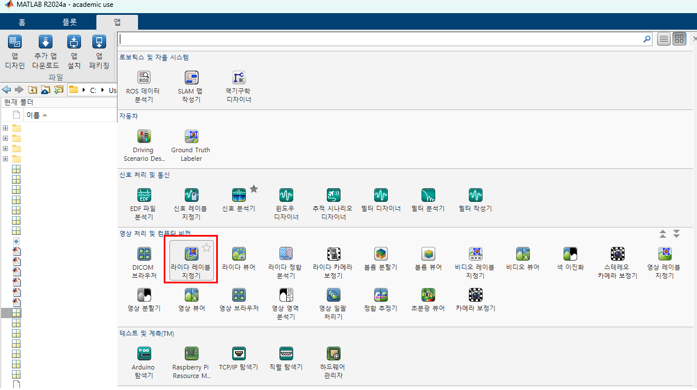
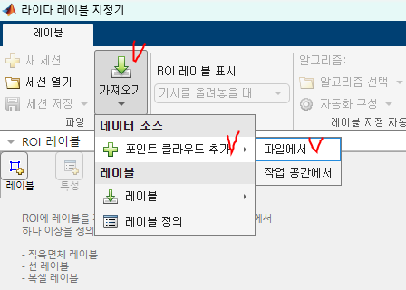
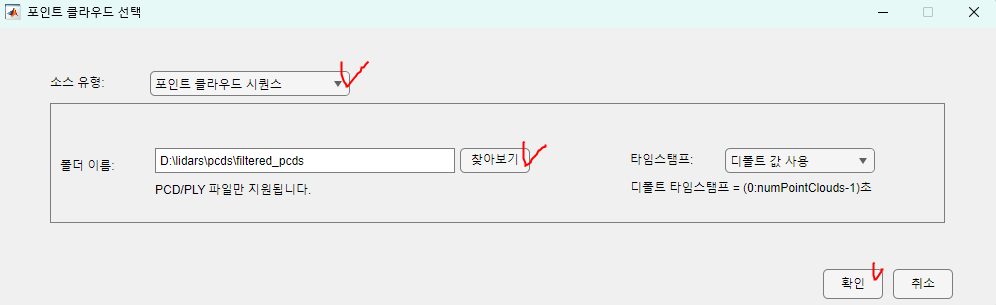
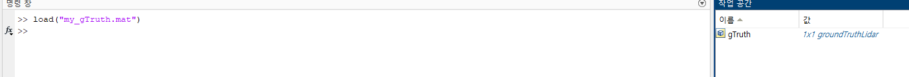
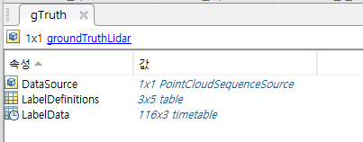
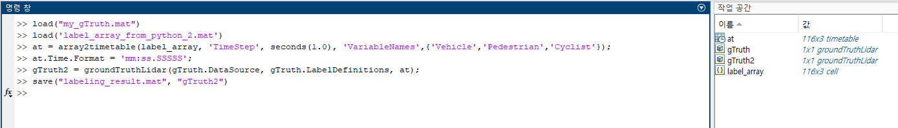
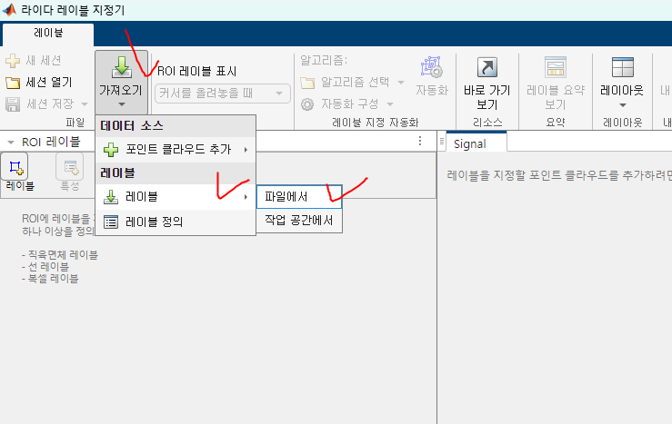
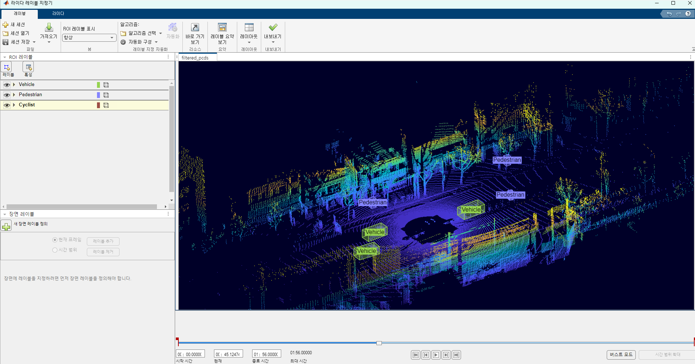

# PointCloud-Labeling-using-MATLAB-LiDAR-Labeler-with-OpenPCDet

1. MATLAB 실행 및 LiDAR Labeler 실행


2. 포인트 클라우드 LOAD 하기


3. pcd 파일이 위치한 폴더 지정 후 확인


4. Label 불러오기
- label.mat 파일로 세팅하면됨


5. gTruth 구조 저장하기
- 아직 Label 정보가 없지만, gTruth 구조체를 저장한다.
- OpenPCDet 을 활용하여 Auto-Labeling 을 수행 후, 레이블링 정보를 해당 구조체에 덮어쓰기 할 것임.


6. load 함수로 gTruth가 잘 저장되었는지 확인



7. OpenPCDet을 활용한 label_array 생성
- Auto-Labeling을 수행한다는 의미
- OpenPCDet 의존성 필요
- 코드는 pcdet_auto_labeling.py를 확인

8. Auto Labeled 정보 추가하기


```matlab
>> load("my_gTruth.mat")
>> load('label_array_from_python_2.mat')
>> at = array2timetable(label_array, 'TimeStep', seconds(1.0), 'VariableNames',{'Vehicle','Pedestrian','Cyclist'});
>> at.Time.Format = 'mm:ss.SSSSS';
>> gTruth2 = groundTruthLidar(gTruth.DataSource, gTruth.LabelDefinitions, at);
>> save("labeling_result.mat", "gTruth2")
```

위 코드의 의미?
기존에 저장한 gTruth 구조를 참고하여 gTruth2를 만들고,  
Auto-Labeled된 정보를 gTruth2 라는 구조체에 추가함.  
그리고 gTruth2를 저장함   

9. Auto-Labeled 결과 확인
- MATLAB LiDAR Labeler 실행 후, 8번에서 저장한 파일을 불러온다



